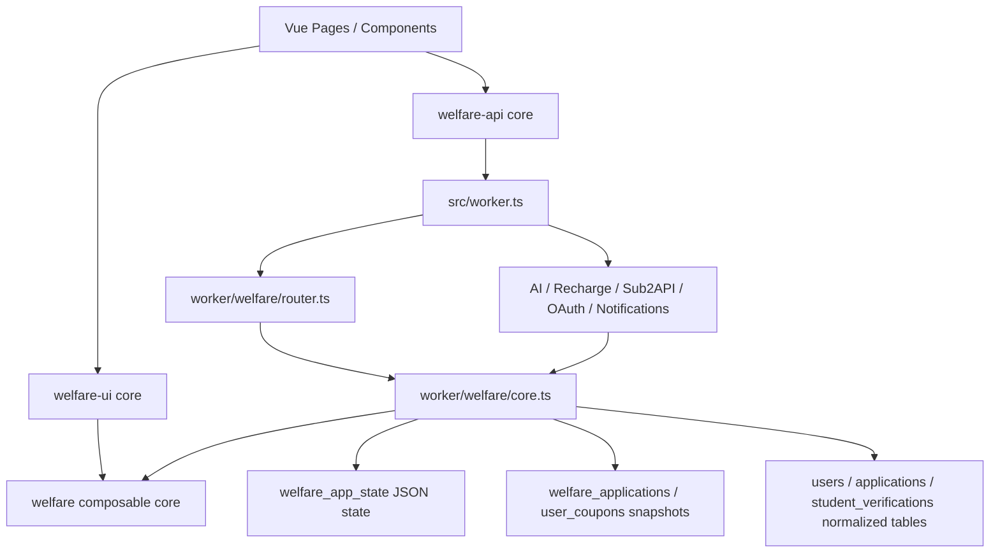

# Touch Great Welfare 系统性项目分析报告

生成日期：2026-06-21

## 执行摘要

该项目当前处于“功能覆盖较广、质量门禁可通过、架构债务明显累积”的状态。`pnpm run check` 已通过 lint、类型检查和 183 个测试，`pnpm run build` 也可成功产物输出；因此问题并非简单的语法错误或局部测试失败，而是集中在模块边界、状态模型、生产配置约束、迁移路径和依赖治理上。

最突出的问题是前后端边界被同一个大型 `welfare` composable 穿透。Worker 侧业务核心直接从前端 composable 导入类型、定价、状态归一化和业务规则，而该 composable 自身又导入 Vue reactivity 与前端持久化逻辑。这使领域模型、服务端业务规则和浏览器状态管理混在同一条依赖链中，短期能减少重复，长期会让任何规则变更同时影响前端、Worker、测试和打包体积。

第二个高风险点是数据架构处于迁移中间态。项目同时存在 JSON 状态表、快照表、规范化表、运行时补 schema、Repository 抽象和 `USE_NORMALIZED_TABLES` 切换逻辑，但真正从规范化表读取的实现只覆盖很小一部分状态字段。这种中间态若被误开到生产，会导致功能性数据缺失。本轮处理已把该实验开关加入生产配置禁用检查，后续仍需补齐迁移读取路径。

第三个风险来自生产配置与文档口径不一致。分析时 README 说明生产使用 Hyperdrive/PostgreSQL，但 `wrangler.production.jsonc` 仍保留名为 preview 的 `LOCAL_DB` D1 绑定，且 `check-production-config` 脚本允许“Hyperdrive 或 LOCAL_DB 任一存在”即可通过。本轮处理已移除生产 `LOCAL_DB`，加入 `HYPERDRIVE` 占位绑定，并强制生产检查要求有效 Hyperdrive ID。

此外，构建产物存在明显包体压力，`vite build` 报告多个 chunk 超过 500KB，其中 `core` chunk 压缩前约 1.4MB。分析时 `pnpm audit` 报告 48 个依赖漏洞，其中包含 1 个 critical、22 个 high；本轮通过移除未使用的 Vue Macros 依赖链并增加必要 overrides 后，生产依赖审计已恢复通过。

## 验证结果

`pnpm run check` 当前通过，覆盖 `eslint .`、`vue-tsc` 和 `vitest run`。测试结果为 21 个测试文件、183 个测试通过。运行过程中可观察到两个预期失败路径的 stderr：Repository 双写失败回退、LINUX DO Credit notify 在缺少 Hyperdrive binding 时失败。它们没有造成测试失败，但说明测试确实覆盖了一些降级路径。

`pnpm run build` 当前通过，但 Vite 输出 chunk 体积警告。主要异常体积包括 `core-C9kwxtt0.js` 约 1399.75KB、`TxCodeEditorRuntime` 约 628.19KB、若干 `index` chunk 超过 500KB。这与源码层面的“大型核心模块承担过多职责”相互印证。

`pnpm run check:production-config` 在仓库占位 Hyperdrive ID 下会失败，这是当前期望行为；生产部署必须提供真实 `hyperdrive[HYPERDRIVE].id`，或通过 `HYPERDRIVE_ID` 环境变量注入后再检查。该脚本现在同时禁止生产配置 `LOCAL_DB`，并禁止生产开启 `USE_NORMALIZED_TABLES=true` 与 `ENABLE_TEMP_ADMIN_ENDPOINTS=true`。

`pnpm audit --prod --audit-level moderate` 当前通过。分析阶段暴露出的主要生产依赖问题已通过 overrides 收敛；包含 dev/test/build 依赖的 `pnpm audit --audit-level moderate` 仍报告 32 个漏洞，主要集中在 Vitest、Vite、jsdom、`@vue/test-utils` 和 ESLint 传递链，后续应作为受控升级处理。

## 架构视图

这张图里最不正常的箭头是 `WorkerCore --> WelfareStore`。从工程分层看，Worker 运行时不应该依赖一个位于 `src/composables` 且导入 Vue 的前端状态模块。更合理的方向是把领域类型、常量、定价和纯函数提取到 `src/shared` 或 `src/domain`，然后由前端 store 和 Worker 分别依赖该共享内核。

## 关键问题

### P0：生产数据架构约束没有被配置检查守住

README 明确描述生产使用 Hyperdrive/PostgreSQL，本地使用 D1。分析时 `wrangler.production.jsonc` 只配置了 `LOCAL_DB`，且 database_name 是 `touchx-universe-preview`，未配置 `hyperdrive`。同时，`scripts/check-production-config.mjs` 只在 Hyperdrive 与 LOCAL_DB 都不可用时失败，因此生产配置能错误通过检查。本轮已将生产配置改为 `HYPERDRIVE` 绑定占位，并让检查脚本强制拒绝 `LOCAL_DB`。

证据位于 [README.md](/Users/talexdreamsoul/Workspace/touch-great-welfare/README.md:51)、[wrangler.production.jsonc](/Users/talexdreamsoul/Workspace/touch-great-welfare/wrangler.production.jsonc:23)、[scripts/check-production-config.mjs](/Users/talexdreamsoul/Workspace/touch-great-welfare/scripts/check-production-config.mjs:31)。

影响是生产架构意图曾经无法被自动化守护。若实际部署按 D1 运行，系统会偏离文档中的 PostgreSQL/Hyperdrive 模型；若某些功能路径调用 `getPool`，在无 Hyperdrive 时会直接抛出 `Hyperdrive binding is required`。当前检查已能阻断这种误配，但部署前仍需要填入真实 Hyperdrive ID。

处理状态：已按“生产必须 PostgreSQL/Hyperdrive、本地使用 D1”的决策修正配置和检查。剩余动作是创建或确认真实 Hyperdrive 实例，并把 ID 写入生产配置或通过 CI 环境变量 `HYPERDRIVE_ID` 注入。

### P0：规范化表读取路径不完整，误开会造成状态缺失

`readWelfareState` 在 `USE_NORMALIZED_TABLES === 'true'` 时切到 `readWelfareStateFromTables`。该函数只读取 users、applications、student_verifications，并返回空的 pointTransactions/transactions；而完整 `WelfareState` 还包含 oauth、applicationPolicy、siteBanner、systemConfig、couponTemplates、couponCodes、coupons、dailyCheckIns、invitationBindings、crowdReviews、collaborationApplications、squarePosts、squareBoosts、squareReports 等关键字段。

证据位于 [src/worker/welfare/core.ts](/Users/talexdreamsoul/Workspace/touch-great-welfare/src/worker/welfare/core.ts:1355)、[src/worker/welfare/hybrid-read.ts](/Users/talexdreamsoul/Workspace/touch-great-welfare/src/worker/welfare/hybrid-read.ts:8)、[src/composables/welfare/core.ts](/Users/talexdreamsoul/Workspace/touch-great-welfare/src/composables/welfare/core.ts:615)。

影响是规范化读取开关并不等价于完整状态读取。若该开关在生产或预览环境开启，多个页面和服务端动作会得到缺失字段，轻则功能退化，重则触发状态初始化错误或覆盖写回不完整数据。

处理状态：已把 `USE_NORMALIZED_TABLES=true` 加入生产配置禁止项。后续仍需逐表补齐读取映射与一致性测试；迁移未完成前，不应将 table read 作为用户请求主路径。

### P1：前后端边界被 composable 穿透

Worker 核心模块曾直接从 `~/composables/welfare` 导入大量类型、常量和业务函数；而 `src/composables/welfare/core.ts` 本身导入了 Vue 的 `computed`、`reactive`、`ref`，还导入前端 persistence API。也就是说服务端业务运行时依赖了前端状态文件的模块顶层。本轮已先把 Worker 的纯类型导入迁移到 `src/shared/welfare-types.ts`，并新增 `src/shared/welfare-domain.ts` 承载第一批纯领域常量和函数，包括模型定价、活动折扣、系统配置归一化、邀请码和教育邮箱收件箱。外围 Worker 已改为直接依赖 shared domain；`worker/welfare/core.ts` 仍残留一条对 composable 的依赖，用于尚未迁移的资源规则、应用策略和状态规则。

证据位于 [src/worker/welfare/core.ts](/Users/talexdreamsoul/Workspace/touch-great-welfare/src/worker/welfare/core.ts:1)、[src/composables/welfare/core.ts](/Users/talexdreamsoul/Workspace/touch-great-welfare/src/composables/welfare/core.ts:1)、[src/composables/welfare/core.ts](/Users/talexdreamsoul/Workspace/touch-great-welfare/src/composables/welfare/core.ts:12)。

影响是模块职责不清，且对打包、测试、运行时兼容性都有隐性成本。任何看似前端 store 的改动都可能改变 Worker 行为；任何服务端规则调整也可能拉动前端包体和响应式状态。SOLID 视角下，这是单一职责和依赖倒置同时失效。

处理状态：已建立过渡性的 type-only 边界 `src/shared/welfare-types.ts`，并落地第一批真正的纯领域层 `src/shared/welfare-domain.ts`。下一步应继续把资源条款、资源类型配置、资源申请校验、应用策略归一化等从 composable 迁出；迁移完成后，Vue store 只负责响应式状态和 UI 适配，Worker 只负责认证、持久化、事务和外部集成。

### P1：核心模块过大，已经形成 God Object

源码统计显示 167 个 TS/Vue 文件总计约 53532 行，但头部几个文件高度集中：`AdminPanelCore.vue` 6133 行、`src/composables/welfare/core.ts` 5774 行、`src/worker/welfare/core.ts` 4933 行、`src/composables/welfare-ui/core.ts` 3751 行、`src/worker/notifications.ts` 3692 行。单文件行数本身不是 bug，但这些文件同时承担模型、规则、状态、UI 编排、API 适配和副作用，已经超出普通维护边界。

证据位于 [src/components/welfare/admin/AdminPanelCore.vue](/Users/talexdreamsoul/Workspace/touch-great-welfare/src/components/welfare/admin/AdminPanelCore.vue:1)、[src/composables/welfare/core.ts](/Users/talexdreamsoul/Workspace/touch-great-welfare/src/composables/welfare/core.ts:1)、[src/worker/welfare/core.ts](/Users/talexdreamsoul/Workspace/touch-great-welfare/src/worker/welfare/core.ts:1)。

影响是变更半径变大，测试定位变慢，冲突概率升高，代码审查难度明显上升。KISS 与 SRP 角度看，应优先拆出稳定的纯函数和领域服务，而不是继续在大文件末尾追加功能。

修复建议按风险排序拆分，而不是一次性重构。第一步提取领域纯函数和类型；第二步把 Worker action 按申请、认证、钱包、审核、配置拆到独立 service；第三步拆 Admin 面板为配置、用户、申请、通知、资源发放几个局部容器。

### P1：迁移体系存在重复模型和半成品抽象

项目同时存在 JSON 状态、快照表、规范化 schema、Repository 抽象、runtime schema guard、迁移脚本和多份阶段报告。`BaseRepository` 默认双写但 table 写失败只记录日志不抛出；`readWelfareStateFromTables` 与 Repository 抽象又不是同一套完整读取路径。这表明迁移方案没有收敛为一条主线。

证据位于 [src/worker/welfare/core/repository/base.ts](/Users/talexdreamsoul/Workspace/touch-great-welfare/src/worker/welfare/core/repository/base.ts:28)、[src/worker/welfare/core/repository/base.ts](/Users/talexdreamsoul/Workspace/touch-great-welfare/src/worker/welfare/core/repository/base.ts:144)、[src/worker/welfare/hybrid-read.ts](/Users/talexdreamsoul/Workspace/touch-great-welfare/src/worker/welfare/hybrid-read.ts:1)。

影响是工程人员很难判断“真实数据源”到底是哪一个。双写失败被吞掉可提高可用性，但也可能长期积累表数据不一致；一致性检查只比较 JSON 序列化前 100 字符的日志，不能作为迁移验收依据。

修复建议是冻结新 schema 迁移，先写一份当前主数据源决策文档。随后将迁移路径收敛为三段：state-only 稳定期、dual-write 观测期、table-read 灰度期。每段都需要独立的配置检查、指标、回滚条件和数据一致性报告。

### P1：依赖安全治理落后

分析时 `pnpm audit --audit-level moderate` 失败，报告 48 个漏洞，其中 1 个 critical、22 个 high、19 个 moderate、6 个 low。关键项包括 `vitest >=4.0.0 <4.1.0` 的 Vitest UI 风险、`vite <=7.3.1` 的路径遍历风险、`minimatch` 多个 ReDoS、`postcss <8.5.10` 的 XSS、以及 `@talex-touch/tuffex` 传递依赖 DOMPurify 的漏洞。

处理状态：已移除未使用的 `unplugin-vue-macros` 和 `@vue-macros/volar`，改回 Vue 官方插件；同时通过 workspace overrides 固定 `dompurify`、`picomatch`、`postcss`、`yaml` 的修复版本。`pnpm audit --prod --audit-level moderate` 已恢复通过。

后续建议是做一次受控的 dev/build 依赖升级，重点验证 Vite、Vitest、jsdom、Vue TSC 和 ESLint 链路。此前尝试直接升级会被 `trustPolicy: no-downgrade` 拦截，因此应继续保持供应链策略，不为了升级绕过信任检查。

### P2：富文本 sanitizer 是自研实现，风险可控但维护成本偏高

项目通过 `sanitizeRichText` 白名单过滤标签和属性，再通过 `v-html` 展示。当前实现会移除所有属性，仅恢复安全的 `href`、`src`、`alt` 等字段，整体比直接 `v-html` 安全很多。但它仍是自研 HTML sanitizer，且服务端无 DOM 时只做 HTML escape，这意味着同一函数在浏览器和 Worker 环境的语义不同。

证据位于 [src/utils/rich-text.ts](/Users/talexdreamsoul/Workspace/touch-great-welfare/src/utils/rich-text.ts:55)、[src/components/welfare/RichTextView.vue](/Users/talexdreamsoul/Workspace/touch-great-welfare/src/components/welfare/RichTextView.vue:13)、[src/components/welfare/RichTextEditor.vue](/Users/talexdreamsoul/Workspace/touch-great-welfare/src/components/welfare/RichTextEditor.vue:204)。

影响是安全正确性依赖本地维护，未来新增标签、属性、粘贴行为或图片来源时容易绕出边界。当前 `IMG` 只允许 https URL，而编辑器粘贴图片时插入 data URL 后会被 sanitizer 移除，这也可能造成体验与代码意图不一致。

修复建议是明确富文本策略。若只需要少量格式，继续保留自研白名单但补充 XSS 用例和 data URL 行为测试；若未来要支持更多 HTML，应改用成熟 sanitizer 并锁定配置。

### P2：前端包体和路由懒加载仍需治理

构建报告显示多个 chunk 超过 500KB，尤其 `core` chunk 约 1.4MB。结合源码结构看，大型 composable 和后台面板很可能被多个页面共享拉入，导致首屏或核心路径承担不必要代码。

影响是加载性能和缓存效率下降。即使 gzip 后体积较小，移动网络和低性能设备仍会受到 JS parse/execute 成本影响。

修复建议是先用 bundle visualizer 定位大 chunk 来源，然后把后台面板、代码编辑器运行时、富文本编辑器和大规模业务 store 拆成按路由或按功能动态加载。拆包前应先完成领域层抽离，否则只是把同一个大依赖拆成多个入口。

### P2：本地草稿使用 localStorage，需要明确隐私边界

项目声明业务数据不再保存在浏览器本地存储，但局部草稿仍使用 `localStorage`，包括通用草稿和学生认证请求 ID。UI 文案有提示草稿会临时保存在本地浏览器，因此这不一定是 bug，但文档口径容易让人误解为完全无本地业务数据。

证据位于 [src/composables/local-draft.ts](/Users/talexdreamsoul/Workspace/touch-great-welfare/src/composables/local-draft.ts:27)、[src/components/welfare/StudentCreatePanel.vue](/Users/talexdreamsoul/Workspace/touch-great-welfare/src/components/welfare/StudentCreatePanel.vue:270)、[README.md](/Users/talexdreamsoul/Workspace/touch-great-welfare/README.md:168)。

影响是隐私和合规表述不精确。学生认证、申请理由或资料草稿可能包含敏感信息，虽然 TTL 为 24 小时，但仍应被明确列入数据处理说明。

修复建议是区分“服务端业务状态”和“浏览器草稿缓存”。文档中应说明 localStorage 仅用于未提交草稿，提交后清理，并列出敏感字段是否会缓存。

## 优先级路线图

第一阶段应先处理生产安全边界。生产配置策略、生产数据库检查、`USE_NORMALIZED_TABLES` 生产禁用、临时管理端点生产禁用，以及生产依赖 audit 已在本轮完成。剩余的第一阶段动作是写入真实 Hyperdrive ID，并在 CI 中执行同一套生产配置检查。

第二阶段应收敛领域层。类型边界与第一批纯领域常量/函数已迁移到 shared；后续需要继续将资源规则、应用策略、状态归一化和用户等级计算迁移到纯 TS shared/domain 包。完成后 Worker 不再从 composable 导入运行时代码，前端 store 也不再承载领域规则本体。

第三阶段应治理数据迁移。明确主数据源，删除或隔离半成品读取路径，补全 table-read 映射测试。只有当规范化表能完整表达 `WelfareState` 并通过一致性验证后，才允许逐步灰度读取。

第四阶段再做 UI 与包体拆分。优先拆 Admin 面板和大型 UI composable，避免在领域层尚未抽离时进行表面拆文件。拆分目标不是单纯降低行数，而是让模块按“配置、申请、钱包、认证、通知、资源发放”形成稳定边界。

## SOLID / KISS / DRY / YAGNI 结论

从 SOLID 看，当前最大的违反点是单一职责和依赖倒置。前端 composable 同时是类型中心、领域规则中心、状态 store 和 UI 适配层；Worker 又依赖它，形成反向依赖。

从 KISS 看，项目为了兼容迁移、旧接口、新接口、D1、PostgreSQL、快照表和规范化表，引入了过多并行路径。短期兼容可以理解，但需要及时收敛，否则复杂度会继续侵蚀稳定性。

从 DRY 看，部分规则被复用到了前后端，这是好的动机；但复用的位置不对。真正应该复用的是纯领域层，而不是复用一个带 Vue 和浏览器 persistence 的 composable。

从 YAGNI 看，Repository 抽象、规范化读取开关、迁移脚本和多套 schema 当前都还没有形成生产闭环。未完成能力应当被显式标为实验并默认不可用，避免看起来“已经可用”。

## 附录：本次执行命令

本次分析执行了 `pnpm run check`、`pnpm run build`、`pnpm run check:production-config`、`pnpm audit --audit-level moderate`，并通过 `rg`、`find`、`nl` 阅读了入口、Worker 核心、前端 composable、生产配置、迁移和安全相关代码。
